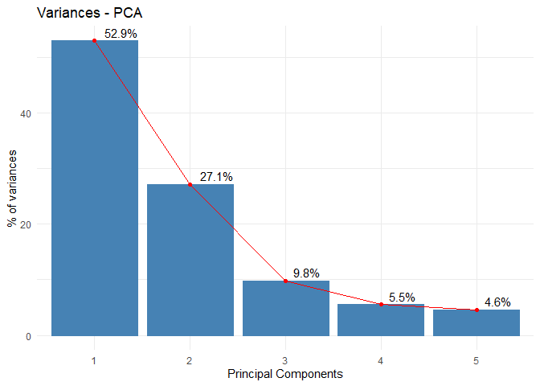
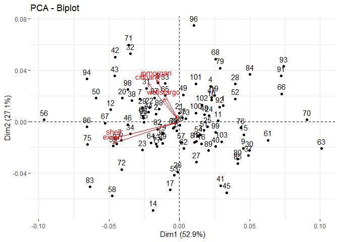

PCA
================
Beth
2019/11/11

load data
=========

``` r
library("factoextra")
address=pracma::pwd()
Stock<- read.csv(paste0(address,"/csv/T0804.csv"))
```

SVD
===

``` r
S <- cov(Stock) 
knitr::kable(S)
```

|            |   jpmorgan|   citibank|  wellsfargo|      shell|      exxon|
|------------|----------:|----------:|-----------:|----------:|----------:|
| jpmorgan   |  0.0004333|  0.0002757|    1.59e-04|  0.0000641|  0.0000890|
| citibank   |  0.0002757|  0.0004387|    1.80e-04|  0.0001815|  0.0001233|
| wellsfargo |  0.0001590|  0.0001800|    2.24e-04|  0.0000734|  0.0000605|
| shell      |  0.0000641|  0.0001815|    7.34e-05|  0.0007225|  0.0005083|
| exxon      |  0.0000890|  0.0001233|    6.05e-05|  0.0005083|  0.0007657|

``` r
A<-eigen(S)$vector
colnames(A)=colnames(Stock)
knitr::kable(A)
```

|   jpmorgan|    citibank|  wellsfargo|       shell|       exxon|
|----------:|-----------:|-----------:|-----------:|-----------:|
|  0.2228228|   0.6252260|   0.3261122|   0.6627590|   0.1176595|
|  0.3072900|   0.5703900|  -0.2495901|  -0.4140935|  -0.5886080|
|  0.1548103|   0.3445049|  -0.0376393|  -0.4970499|   0.7803043|
|  0.6389680|  -0.2479475|  -0.6424974|   0.3088689|   0.1484555|
|  0.6509044|  -0.3218478|   0.6458606|  -0.2163758|  -0.0937178|

``` r
pca <- prcomp(formula = ~ .,  data = Stock,scale =F) 
```

Screen plot
===========

``` r
fviz_eig(pca, addlabels=TRUE, hjust = -0.3,linecolor ="red")+
  theme_minimal()+
  labs(title = "Variances - PCA",
         x = "Principal Components", y = "% of variances")
```



Pc score
========

``` r
fviz_pca_biplot(pca, ggtheme = theme_minimal(), col.var = "red")
```


